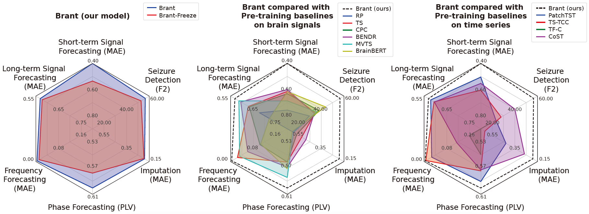

<br>

<!-- <div align=center >

</div> -->

<div align=center>

</div> 

<br>


<center><font size="6"> Abstract </font><br/> </center>

Brant is a foundation model for modeling intracranial recordings, which learns powerful representations of intracranial neural signals by pre-training, as a large-scale, off-the-shelf model for medicine. 
Brant is the largest model in the field of brain signals and is pre-trained on a large corpus of intracranial data. The design of Brant is to capture long-term temporal dependency and spatial correlation from neural signals, combining the information in both time and frequency domains. 

<!-- As a foundation model, Brant achieves SOTA performance on various downstream tasks (i.e. neural signal forecasting, frequency-phase forecasting, imputation and seizure detection), showing the generalization ability to a broad range of tasks.  -->

<br>

<br>

<center><font size="6"> Model Scale </font><br/> </center>

Brant is the largest model on brain signals and pre-trained on a large intracranial dataset collected by us. 
As shown in the figure below, Brant contains over 500M parameters, far more than other existing works on brain signals.

<div align=center>

</div> 

<br>

<br>

<center><font size="6"> Performance </font><br/> </center>

The figure below summarizes the results of all the downstream tasks, including neural signal forecasting, frequency-phase forecasting, imputation and seizure detection. As a foundation model for intracranial recordings, compared with other baselines, Brant achieves consistent SOTA performance on a variety of tasks w.r.t. several medical scenarios, showing the great potential in neural recordings modeling.

<div align=center>

</div>

<br>

<br>

<center><font size="6"> Limitations </font><br/> </center>

By pre-training on a large amount of intracranial data, Brant contains over 500M parameters, far more than other existing works on brain signals. However, compared to other fields such as CV and NLP in which the models can reach billions of parameters and achieve good performance on a variety of tasks by zero-shot learning, there is still potential for further improvement of our work. In the future, by scaling up our dataset, the scale of our model can be further expanded to capture higher-level semantic information from neural data, revealing more complicated brain activities and dynamics, to provide assistance for more healthcare applications.

<br>

<br>

<center><font size="6"> BibTeX </font><br/> </center>

```
@article{zhang2022brant,
  title={Brant: Foundation Model for Intracranial Neural Signal},
  author={Zhang, Daoze and Yuan, Zhizhang and Yang, Yang and Wang, Jingjing and Chen, Junru and Li, Yafeng},
  journal={Advances in Neural Information Processing Systems},
  year={2023}
}
```

<br>

<br>

<center><font size="6"> Ethics Statement </font><br/> </center>

The data collection and experiments conducted in our work have been approved by the Institutional Review Board (IRB) and passed ethical review. All participants have signed informed consent forms.

<br>

<br>

<br>


<!-- 
Text can be **bold**, _italic_, or ~~strikethrough~~.

[Link to another page](./another-page.html).

There should be whitespace between paragraphs.

There should be whitespace between paragraphs. We recommend including a README, or a file with information about your project.

# Header 1

This is a normal paragraph following a header. GitHub is a code hosting platform for version control and collaboration. It lets you and others work together on projects from anywhere.

## Header 2

> This is a blockquote following a header.
>
> When something is important enough, you do it even if the odds are not in your favor.

### Header 3

```js
// Javascript code with syntax highlighting.
var fun = function lang(l) {
  dateformat.i18n = require('./lang/' + l)
  return true;
}
```

```ruby
# Ruby code with syntax highlighting
GitHubPages::Dependencies.gems.each do |gem, version|
  s.add_dependency(gem, "= #{version}")
end
```

#### Header 4

*   This is an unordered list following a header.
*   This is an unordered list following a header.
*   This is an unordered list following a header.

##### Header 5

1.  This is an ordered list following a header.
2.  This is an ordered list following a header.
3.  This is an ordered list following a header.

###### Header 6

| head1        | head two          | three |
|:-------------|:------------------|:------|
| ok           | good swedish fish | nice  |
| out of stock | good and plenty   | nice  |
| ok           | good `oreos`      | hmm   |
| ok           | good `zoute` drop | yumm  |

### There's a horizontal rule below this.

* * *

### Here is an unordered list:

*   Item foo
*   Item bar
*   Item baz
*   Item zip

### And an ordered list:

1.  Item one
1.  Item two
1.  Item three
1.  Item four

### And a nested list:

- level 1 item
  - level 2 item
  - level 2 item
    - level 3 item
    - level 3 item
- level 1 item
  - level 2 item
  - level 2 item
  - level 2 item
- level 1 item
  - level 2 item
  - level 2 item
- level 1 item

### Small image


### Large image


### Definition lists can be used with HTML syntax.

<dl>
<dt>Name</dt>
<dd>Godzilla</dd>
<dt>Born</dt>
<dd>1952</dd>
<dt>Birthplace</dt>
<dd>Japan</dd>
<dt>Color</dt>
<dd>Green</dd>
</dl>

```
Long, single-line code blocks should not wrap. They should horizontally scroll if they are too long. This line should be long enough to demonstrate this.
```

```
The final element.
```
-->
